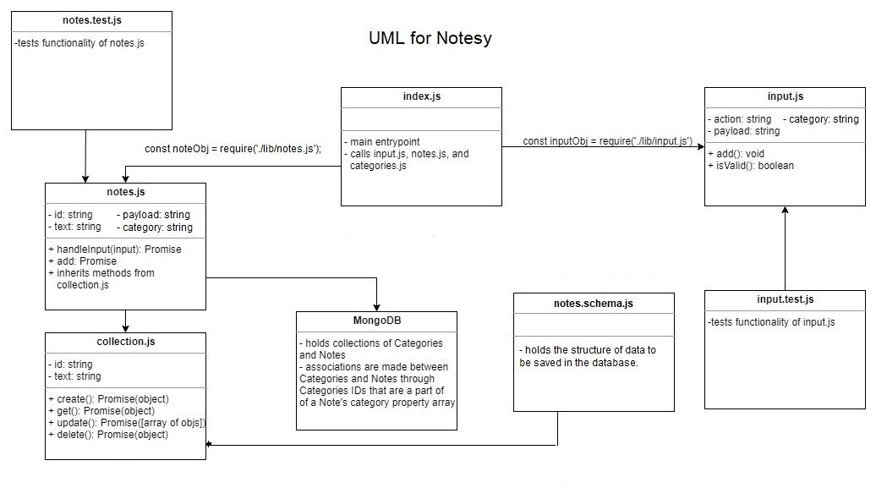

# notes

Note App : An app that can receive user input (a note) and provide some basic output in response.

## Prerequisites:

1. git clone (repo link)
2. npm install

## Flags

- --add or --a --category or -c to add a note
- --list or --l to view notes optional category flag
- --delete or --d to delete a note

## How to use the application

In terminal type:

1. node ./index.js --add "note" --category "category"
2. node ./index.js --list
3. node ./index.js --delete 123456789
4. node ./index.js --list verb

## UML 

## test

The Application works with ES6 classes, and has some unit tests for the modules, using jest.

- To test the app : `npm test`

